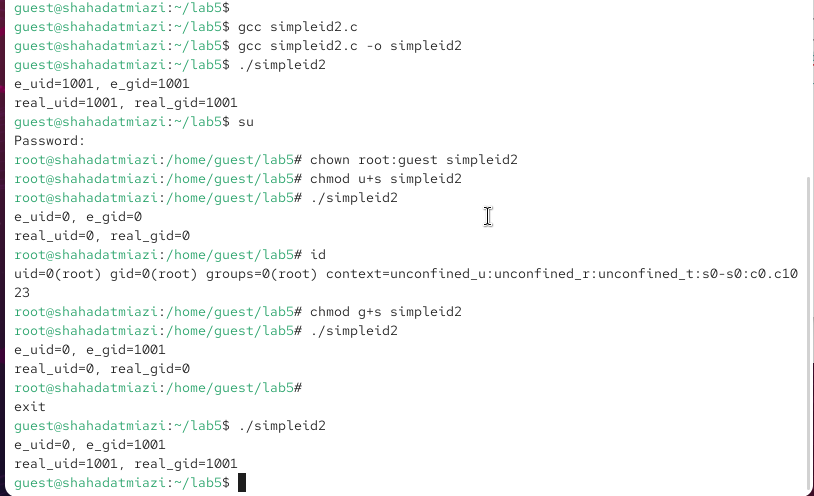
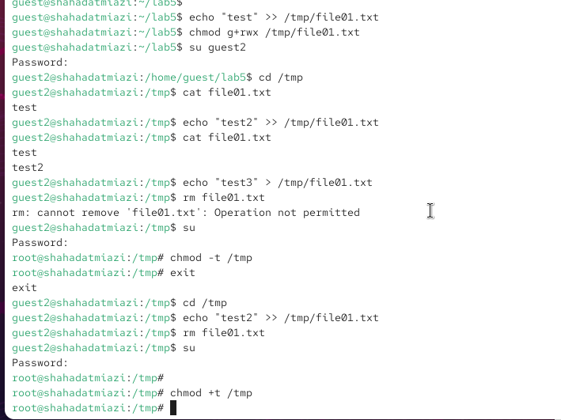

---
## Author
author:
  name: Миази Мд Шахадат Хоссейн
  email: 1032235323@rudn.ru
  affiliation:
    - name: Российский университет дружбы народов
      country: Российская Федерация
      postal-code: 117198
      city: Москва
      address: ул. Миклухо-Маклая, д. 6
	  
## Title
title: "Доклад по лабораторной работе №5"
subtitle: "Дискреционное разграничение прав в Linux. Исследование влияния дополнительных атрибутов"
license: CC BY
date: today
date-format: "YYYY-MM-DD"
---

# Цели и задачи

## Теоретическое введение 

- SUID - разрешение на установку идентификатора пользователя. Это бит разрешения, который позволяет пользователю запускать исполняемый файл с правами владельца этого файла. 

- SGID - разрешение на установку идентификатора группы. Принцип работы очень похож на SUID с отличием, что файл будет запускаться пользователем от имени группы, которая владеет файлом.

## Цель лабораторной работы

Изучение механизмов изменения идентификаторов, применения SetUID и Sticky-битов. Получение практических навыков работы в консоли с дополнительными атрибутами. Рассмотрение работы механизма смены идентификатора процессов пользователей, а также влияние бита Sticky на запись и удаление файлов.

# Выполнение лабораторной работы

## Программа simpleid

{ #fig:001 width=70% height=70%}

## Программа simpleid2

{ #fig:002 width=70% height=70%}

## Программа readfile

{ #fig:003 width=70% height=70%}

## Исследование Sticky-бита

{ #fig:004 width=70% height=70%}

# Выводы

## Результаты выполнения лабораторной работы

Изучили механизмы изменения идентификаторов, применения SetUID- и Sticky-битов. Получили практические навыки работы в консоли с дополнительными атрибутами. Также мы рассмотрели работу механизма смены идентификатора процессов пользователей и влияние бита Sticky на запись и удаление файлов.