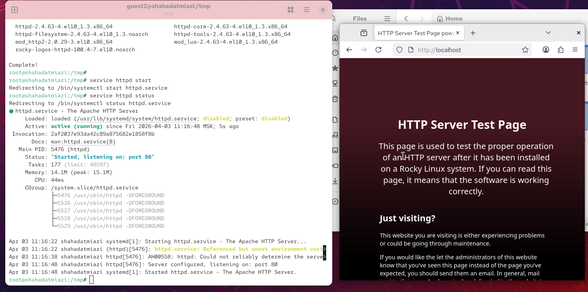
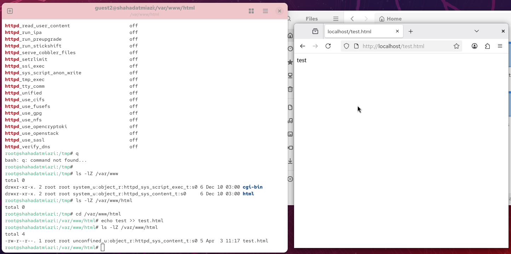

---
## Author
author:
  name: Миази Мд Шахадат Хоссейн
  email: 1032235323@rudn.ru
  affiliation:
    - name: Российский университет дружбы народов
      country: Российская Федерация
      postal-code: 117198
      city: Москва
      address: ул. Миклухо-Маклая, д. 6
	  
## Title
title: "Доклад по лабораторной работе №6"
subtitle: "Знакомство с SELinux"
license: CC BY
date: today
date-format: "YYYY-MM-DD"
---

# Цели и задачи

## Теоретическое введение 

SELinux или Security Enhanced Linux — это улучшенный механизм управления доступом, разработанный Агентством национальной безопасности США (АНБ США) для предотвращения злонамеренных вторжений. Он реализует принудительную (или мандатную) модель управления доступом (англ. Mandatory Access Control, MAC) поверх существующей дискреционной (или избирательной) модели (англ. Discretionary Access Control, DAC), то есть разрешений на чтение, запись, выполнение.

## Теоретическое введение 

Apache – это свободное программное обеспечение для размещения веб-сервера. Он хорошо показывает себя в работе с масштабными проектами, поэтому заслуженно считается одним из самых популярных веб-серверов. Кроме того, Apache очень гибок в плане настройки, что даёт возможность реализовать все особенности размещаемого веб-ресурса.

## Цель лабораторной работы

Развить навыки администрирования ОС Linux. Получить первое практическое знакомство с технологией SELinux. Проверить работу SELinx на практике совместно с веб-сервером Apache

# Выполнение лабораторной работы

## Запуск HTTP-сервера

{ #fig:001 width=70% height=70%}

## Создание HTML-файла

{ #fig:002 width=70% height=70%}

## Изменение контекста безопасности

{ #fig:003 width=70% height=70%}

## Переключение порта и восстановление контекста безопасности

{ #fig:004 width=70% height=70%}

# Выводы

## Результаты выполнения лабораторной работы

В процессе выполнения лабораторной работы мною были получены базовые навыки работы с технологией seLinux.