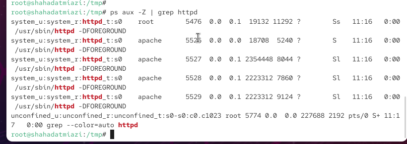
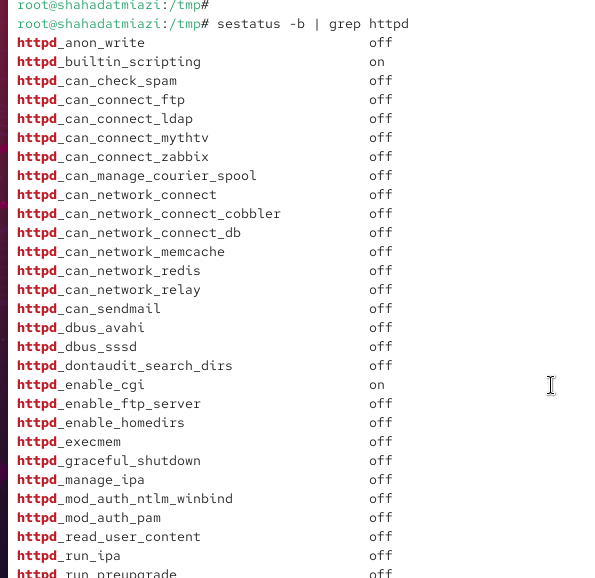
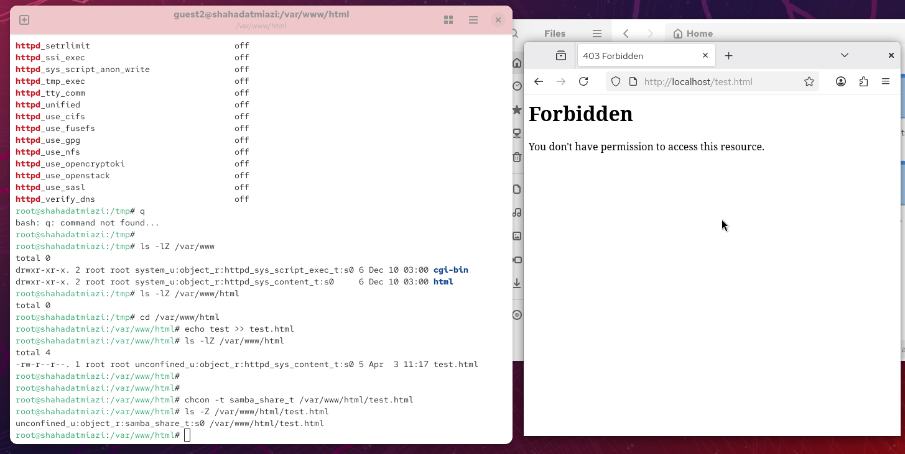
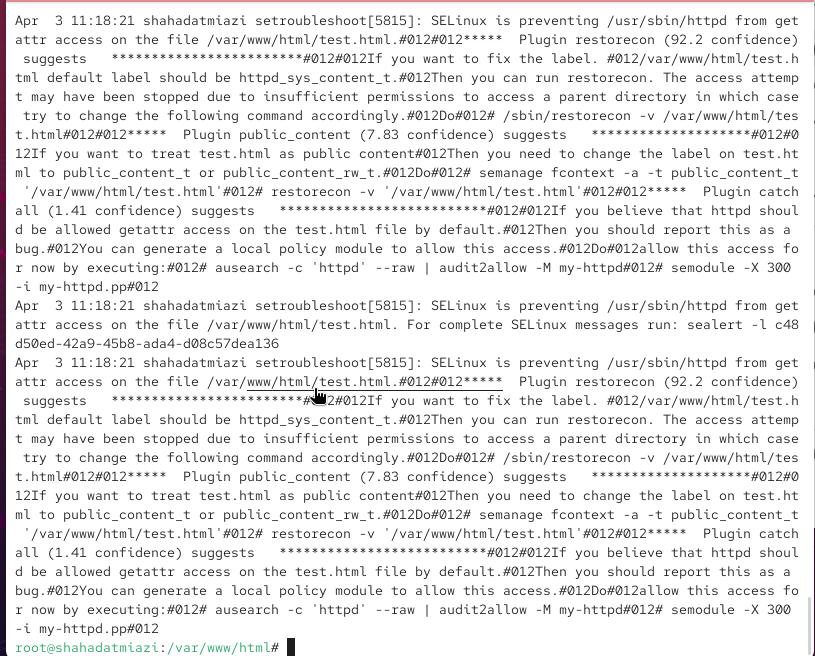
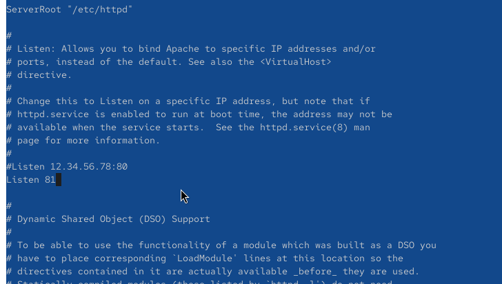
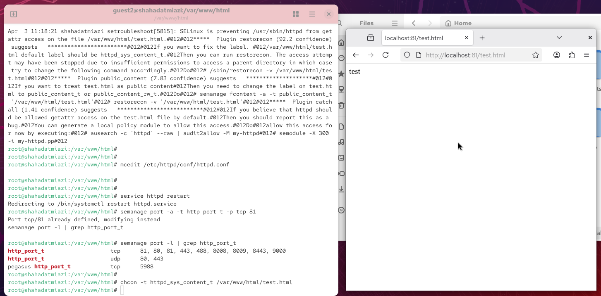

---
## Author
author:
  name: Миази Мд Шахадат Хоссейн
  email: 1032235323@rudn.ru
  affiliation:
    - name: Российский университет дружбы народов
      country: Российская Федерация
      postal-code: 117198
      city: Москва
      address: ул. Миклухо-Маклая, д. 6

## Title
title: "Отчёт по лабораторной работе №6"
subtitle: "Знакомство с SELinux"
license: "CC BY"
---

# Цель работы

Развить навыки администрирования ОС Linux. Получить первое практическое знакомство с технологией SELinux. Проверить работу SELinx на практике совместно с веб-сервером Apache

# Выполнение лабораторной работы

## Подготовка

1. Установили httpd

2. Задали имя сервера

3. Открыли порты для работы с протоколом http

## Изучение механики SetUID

1. Войдите в систему с полученными учётными данными и убедитесь, что SELinux работает в режиме enforcing политики targeted с помощью команд getenforce и sestatus. 

2. Обратитесь с помощью браузера к веб-серверу, запущенному на вашем компьютере, и убедитесь, что последний работает: service httpd status или /etc/rc.d/init.d/httpd status Если не работает, запустите его так же, но с параметром start.

{ #fig:001 width=70% height=70%}

3. Найдите веб-сервер Apache в списке процессов, определите его контекст безопасности и занесите эту информацию в отчёт. Например, можно использовать команду ps auxZ | grep httpd или ps -eZ | grep httpd 

{ #fig:002 width=70% height=70%}

4.	Посмотрите текущее состояние переключателей SELinux для Apache с помощью команды sestatus -bigrep httpd Обратите внимание, что многие из них находятся в положении «off». 

{ #fig:003 width=70% height=70%}

5. Посмотрите статистику по политике с помощью команды seinfo, также определите множество пользователей, ролей, типов.

6. Определите тип файлов и поддиректорий, находящихся в директории /var/www, с помощью команды ls -lZ /var/www. В поддиректориях могут располагаться системные скрипты и контент для http.

7. Определите тип файлов, находящихся в директории /var/www/html: ls -lZ /var/www/html. В директории изначально нет файлов.

8. Определите круг пользователей, которым разрешено создание файлов в директории /var/www/html. Создавать файлы может только root.

9. Создайте от имени суперпользователя (так как в дистрибутиве после установки только ему разрешена запись в директорию) html-файл /var/www/html/test.html следующего содержания:  Test

10. Проверьте контекст созданного вами файла. Занесите в отчёт контекст, присваиваемый по умолчанию вновь созданным файлам в директории /var/www/html.

11. Обратитесь к файлу через веб-сервер, введя в браузере адрес http://127.0.0.1/test.html. Убедитесь, что файл был успешно отображён.

{ #fig:004 width=70% height=70%}

12. Изучите справку man httpd_selinux и выясните, какие контексты файлов определены для httpd. Сопоставьте их с типом файла test.html. Проверить контекст файла можно командой ls -Z. ls -Z /var/www/html/test.html. Основным контекстом является httpd_sys_content_t, его мы и увидели в выводе команды.

13. Измените контекст файла /var/www/html/test.html с httpd_sys_content_t на любой другой, к которому процесс httpd не должен иметь доступа, например, на samba_share_t: chcon -t samba_share_t /var/www/html/test.html ls -Z /var/www/html/test.html После этого проверьте, что контекст поменялся.

14. Попробуйте ещё раз получить доступ к файлу через веб-сервер, введя в браузере адрес http://127.0.0.1/test.html. Вы должны получить сообщение об ошибке: Forbidden You don't have permission to access /test.html on this server. При изменении контекста файл стал считаться чужим для http и программа не может его прочитать.

{ #fig:005 width=70% height=70%}

15. Проанализируйте ситуацию. Почему файл не был отображён, если права доступа позволяют читать этот файл любому пользователю? ls -l /var/www/html/test.html Просмотрите log-файлы веб-сервера Apache. Также просмотрите системный лог-файл: tail /var/log/messages Если в системе окажутся запущенными процессы setroubleshootd и audtd, то вы также сможете увидеть ошибки, аналогичные указанным выше, в файле /var/log/audit/audit.log. Проверьте это утверждение самостоятельно.

{ #fig:006 width=70% height=70%}

16. Попробуйте запустить веб-сервер Apache на прослушивание ТСР-порта 81 (а не 80, как рекомендует IANA и прописано в /etc/services). Для этого в файле /etc/httpd/httpd.conf найдите строчку Listen 80 и замените её на Listen 81.

{ #fig:007 width=70% height=70%}

17. Выполните перезапуск веб-сервера Apache. Произошёл сбой? Поясните почему?
Сбой не происходит, порт 81 уже вписан в разрешенные

18. Проанализируйте лог-файлы: tail -nl /var/log/messages Просмотрите файлы /var/log/http/error_log, /var/log/http/access_log и /var/log/audit/audit.log и выясните, в каких файлах появились записи.

19. Выполните команду semanage port -a -t http_port_t -р tcp 81 После этого проверьте список портов командой semanage port -l | grep http_port_t Убедитесь, что порт 81 появился в списке.

20. Попробуйте запустить веб-сервер Apache ещё раз.

21. Верните контекст httpd_sys_cоntent__t к файлу /var/www/html/ test.html: chcon -t httpd_sys_content_t /var/www/html/test.html После этого попробуйте получить доступ к файлу через веб-сервер, введя в браузере адрес http://127.0.0.1:81/test.html. Вы должны увидеть содержимое файла — слово «test».

{ #fig:008 width=70% height=70%}

22. Исправьте обратно конфигурационный файл apache, вернув Listen 80.

23. Удалите привязку http_port_t к 81 порту: semanage port -d -t http_port_t -p tcp 81 и проверьте, что порт 81 удалён.

24. Удалите файл /var/www/html/test.html: rm /var/www/html/test.html

# Выводы

В процессе выполнения лабораторной работы мною были получены базовые навыки работы с технологией seLinux.

# Список литературы{.unnumbered}

1. [SELinux в CentOS](https://access.redhat.com/documentation/en-us/red_hat_enterprise_linux/6/html/security-enhanced_linux/index)
2. [Веб-сервер Apache](https://httpd.apache.org/)
