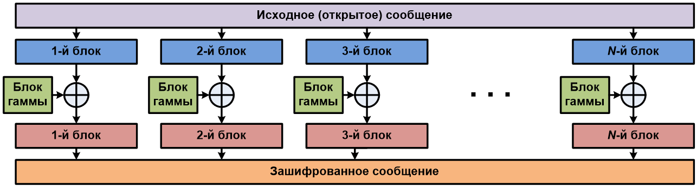
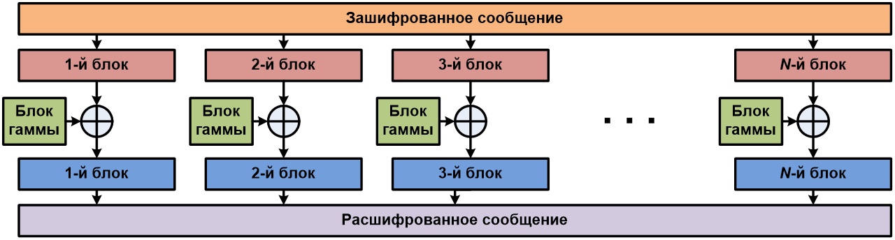
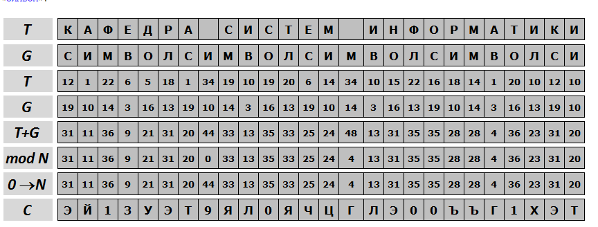
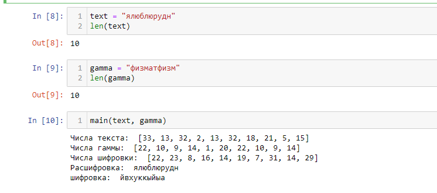

---
## Author
author:
  name: Миази Мд Шахадат Хоссейн
  email: 1032235323@rudn.ru
  affiliation:
    - name: Российский университет дружбы народов
      country: Российская Федерация
      postal-code: 117198
      city: Москва
      address: ул. Миклухо-Маклая, д. 6
	  
## Title
title: "Доклад по лабораторной работе №7"
subtitle: "Шифр гаммирования"
license: CC BY
date: today
date-format: "YYYY-MM-DD"
---

# Цели и задачи

## Цель лабораторной работы

Изучение алгоритма шифрования гаммированием

# Выполнение лабораторной работы

## Гаммирование

Гаммирование – это наложение (снятие) на открытые (зашифрованные) данные криптографической гаммы, т.е. последовательности элементов данных, вырабатываемых с помощью некоторого криптографического алгоритма, для получения зашифрованных (открытых) данных.

## Гаммирование

Наложение (или снятие) гаммы на блок сообщения в рассматриваемом нами стандарте реализуется с помощью операции побитного сложения по модулю 2 (XOR). То есть при шифровании сообщений каждый блок открытого сообщения ксорится с блоком криптографической гаммы, длина которого должна соответствовать длине блоков открытого сообщения. При этом, если размер блока исходного текста меньше, чем размер блока гаммы, блок гаммы обрезается до размера блока исходного текста (выполняется процедура усечения гаммы).

## Алгоритм

{ #fig:001 }

## Алгоритм

{ #fig:002 }

## Формула

В аддитивных шифрах символы исходного сообщения заменяются числами, которые складываются по модулю с числами гаммы. Ключом шифра является гамма, символы которой последовательно повторяются.
Перед шифрованием символы сообщения и гаммы заменяются их номерами в алфавите и само кодирование выполняется по формуле

$$ Ci = (Ti+Gi) mod N $$

## Пример работы алгоритма

{ #fig:003 }

## Пример работы программы

{ #fig:004 }

# Выводы

## Результаты выполнения лабораторной работы

Изучили алгоритм шифрования с помощью гаммирования