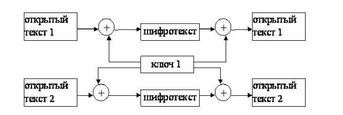
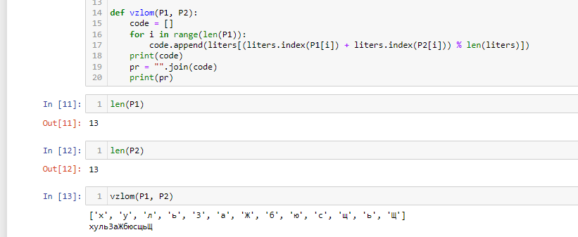
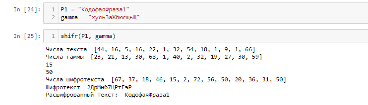

---
## Author
author:
  name: Миази Мд Шахадат Хоссейн
  email: 1032235323@rudn.ru
  affiliation:
    - name: Российский университет дружбы народов
      country: Российская Федерация
      postal-code: 117198
      city: Москва
      address: ул. Миклухо-Маклая, д. 6
	  
## Title
title: "Доклад по лабораторной работе №8"
subtitle: "Шифр гаммирования"
license: CC BY
date: today
date-format: "YYYY-MM-DD"
---

# Цели и задачи

## Цель лабораторной работы

Освоить на практике применение режима однократного гаммирования на примере кодирования различных исходных текстов одним ключом.

# Выполнение лабораторной работы

## Гаммирование

Гаммирование – это наложение (снятие) на открытые (зашифрованные) данные криптографической гаммы, т.е. последовательности элементов данных, вырабатываемых с помощью некоторого криптографического алгоритма, для получения зашифрованных (открытых) данных.

## Алгоритм взлома

Шифротексты обеих телеграмм можно получить по формулам режима однократного гаммирования:

$$C_1 = P_1 \oplus K$$
$$C_2 = P_2 \oplus K$$

## Алгоритм взлома

Открытый текст можно найти, зная шифротекст двух телеграмм, зашифрованных одним ключом. Для это оба равенства складываются по модулю 2. Тогда с учётом свойства операции XOR получаем:

$$C_1 \oplus C_2 = P_1 \oplus  K \oplus  P_2 \oplus  K = P_1 \oplus P_2$$

## Алгоритм взлома

Предположим, что одна из телеграмм является шаблоном — т.е. имеет текст фиксированный формат, в который вписываются значения полей.
Допустим, что злоумышленнику этот формат известен. 
Тогда он получает достаточно много пар $C_1 \oplus C_2$ (известен вид обеих шифровок).
Тогда зная $P_1$ имеем:

$$C_1 \oplus C_2 \oplus P_1 = P_1 \oplus P_2 \oplus P_1 = P_2$$ 

## Схема работы алгоритма

{ #fig:001 }

## Пример работы программы

{ #fig:002 }

{ #fig:003 }

# Выводы

## Результаты выполнения лабораторной работы

В ходе выполнения лабораторной работы было разработано приложение, позволяющее шифровать тексты в режиме однократного гаммирования.