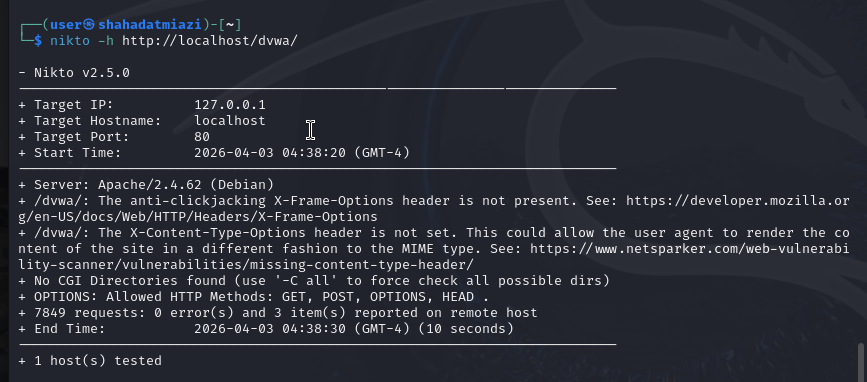

---
## Author
author:
  name: Миази Мд Шахадат Хоссейн
  email: 1032235323@rudn.ru
  affiliation:
    - name: Российский университет дружбы народов
      country: Российская Федерация
      postal-code: 117198
      city: Москва
      address: ул. Миклухо-Маклая, д. 6
	  
## Title
title: "Доклад по лабораторной работе №4"
license: CC BY
date: today
date-format: "YYYY-MM-DD"
---

# Цели и задачи работы

## Цель лабораторной работы

Целью данной работы является изучение сканера уязвимостей nikto.

# Процесс выполнения лабораторной работы

## Введение

**Nikto** — это популярный сканер веб-серверов с открытым исходным кодом, который проверяет веб-серверы на наличие уязвимостей, неправильных настроек, устаревших версий ПО и прочих проблем безопасности.

## Введение

Nikto написан на Perl, и для его работы необходимо наличие Perl на системе.

Сканирование веб-сервера
```bash
perl nikto.pl -h <URL>
```

## Сканирование

Nikto может использоваться для пассивного сканирования DVWA, выявления базовых уязвимостей и проверок на неправильную конфигурацию.

Когда DVWA запущено, мы можем использовать Nikto для сканирования. Основной командой для сканирования будет:

```bash
perl nikto.pl -h http://localhost/dvwa/
```

## Сканирование localhost

{ #fig:001 width=70% height=70% }

## Сканирование localhost/dvwa/

{ #fig:002 width=70% height=70% }

# Выводы по проделанной работе

## Вывод

Мы изучили возможности сканера nikto.